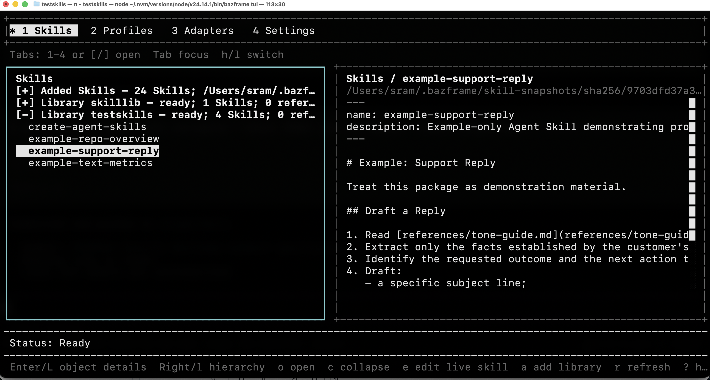

# Bazframe - _Take your harness with you._

Move, package, and distribute [Agent Skills](https://agentskills.io/) and AGENTS.md files between projects and dev environments.



## Quick Start
### Install
```bash
npm i -g bazframe@next
```

### Setup
```bash
# add your skills to bazframe
bazframe library add /path/to/my-skills-folder

# setup your _local_ bazframe profile
bazframe profile add my-coding-harness
bazframe profile edit my-coding-harness
bazframe profile library add my-skills-folder
bazframe profile use my-coding-harness

# connect bazframe to your preferred harness*
bazframe adapter install pi
```
### Running bazframe
Then start your harness like normal:
```bash
pi
```

You should see all your profiles added skills.

 > * The current beta version supports only Pi 0.84.4 or newer on macOS and Linux.

### Requirements

- [Node.js](https://nodejs.org/) 22.19.0 or newer.
- Pi 0.84.4 or newer.
- macOS or Linux.
- A model provider supported by Pi; see [Pi's authentication documentation](https://github.com/earendil-works/pi#readme).
- (optional) [Git](https://git-scm.com/) only for remote Git sources. Basic profile use does not require Git.


### Export and import a profile (Stage 3)

Stage 3 package portability is live on macOS and Linux. It is not a claim of Windows support or full profile portability. Publish a reviewable directory for an explicit profile without changing the active profile:

```bash
bazframe profile export my-coding-harness --output ./my-coding-harness.bazframe-profile
```

Review `./my-coding-harness.bazframe-profile/profile/AGENTS.md` before sharing: Bazframe does not redact secrets from user-authored instructions. Exports are path-free declarations, not copied source trees or snapshots. Remote Git resources record normalized credential-free identity, branch, and exact revision. Healthy local libraries and packages export only `{ "type": "localMapping" }`, without a source-machine path or snapshot digest.

On the destination machine, inspect first. `--map` is repeatable and typed; provide one absolute physical, basename-matching source directory for every declared local library or package:

```bash
bazframe profile import \
  --map library:my-skills-folder=/srv/skill-libraries/my-skills-folder \
  --map package:my-package=/srv/skill-packages/my-package \
  --dry-run ./my-coding-harness.bazframe-profile
bazframe profile import \
  --map library:my-skills-folder=/srv/skill-libraries/my-skills-folder \
  --map package:my-package=/srv/skill-packages/my-package \
  --yes ./my-coding-harness.bazframe-profile
# Or choose only the destination profile ID:
bazframe profile import --as imported-harness \
  --map library:my-skills-folder=/srv/skill-libraries/my-skills-folder \
  --map package:my-package=/srv/skill-packages/my-package \
  --yes ./my-coding-harness.bazframe-profile
```

Dry-run takes no Bazframe write lock and performs no Bazframe writes, network access, builds, prompts, or active-profile mutation. It reports exact historical remote Git revisions and prospective work. Execution creates or exactly reuses branch-reachable historical remote Skills, libraries, and packages, processes packages last, and never substitutes current branch HEAD. An exact healthy package reuse is offline and needs no build, authorization report, prompt, or consent.

Each new package build receives an exact report covering package/source identity, candidate root and working directory, literal argv, manifest path and SHA-256, artifact/Skills roots, `shell: false`, inherited environment, and unsandboxed `current-process-user` authority with possible credential, network, and user-file access. Arbitrary package effects are not rollbackable. Interactive approval accepts only literal `y` and otherwise declines by default; noninteractive execution uses `--yes`. `--yes` is invalid with `--dry-run`.

Import is forward-resumable, not globally atomic: earlier committed resources remain after later failure, recovery/ambiguous outcomes must be inspected, and retry converges through exact reuse. A newly published profile remains inactive; exact reuse of an existing active destination does not change selection. Healthy local direct Skills remain named omissions and have no mapping. Collection children never enter `(default)`. JSON reports omit environment names/values and private filesystem identities, but mapped local roots are intentionally reported. Windows publication and the broader hostile/full-portability acceptance gate remain open.

### Terminal interface

```bash
bazframe tui
```

## Safety

Profiles and Skills become trusted input to an agent with filesystem and shell authority. Libraries execute no source code. Package add, build, and update operations execute declared argv without a shell or sandbox and inherit your user authority. Review remote instructions and package build declarations before activation.

See [Using Skills with Bazframe](docs/skills.md#editing-and-ownership) for ownership and [its troubleshooting section](docs/skills.md#troubleshooting) for recovery details.

## Documentation

1. [Getting started](docs/getting-started.md) — installation, first profile, policy, and configuration.
2. [Using Skills with Bazframe](docs/skills.md) — Skills, libraries, packages, remote Git sources, and Bazify.
3. [Terminal UI design](docs/tui-design.md) — implemented TUI boundary and remaining gates.
4. [Fresh-machine setup recipe](examples/setup-fresh-machine.sh) — bootstrap commands for a new machine.
5. [Product design](docs/design.md) — product contracts for contributors.
6. [Release process](docs/releasing.md) — release validation and publication.

## Support

Report bugs and ask usage questions in [GitHub issues](https://github.com/sram1337/bazframe/issues).

## Contributing

Contributions are welcome. See [CONTRIBUTING.md](CONTRIBUTING.md) for development setup, validation, safety guidance, and pull request expectations.

## License

[MIT](LICENSE)
